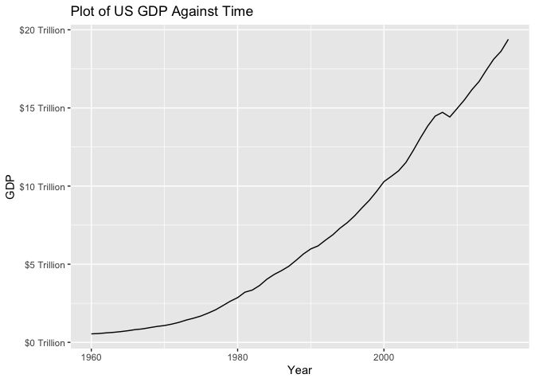
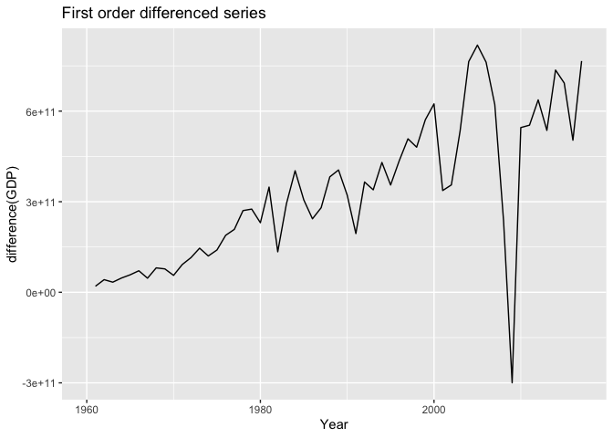
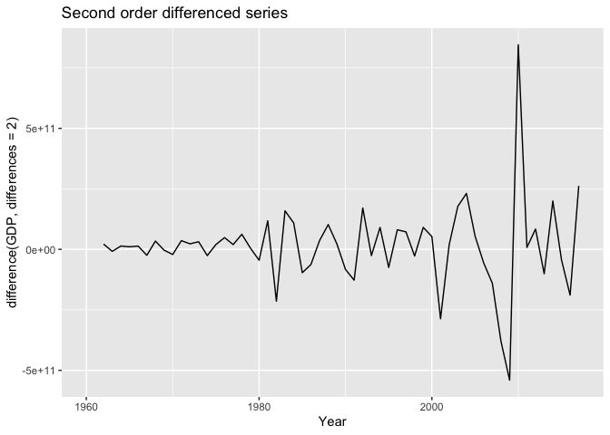
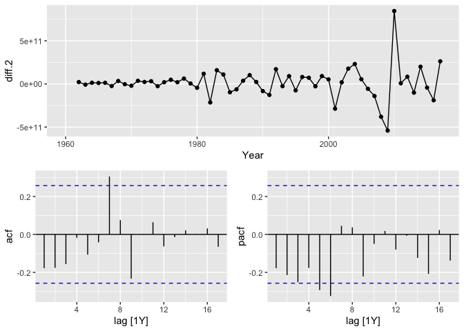
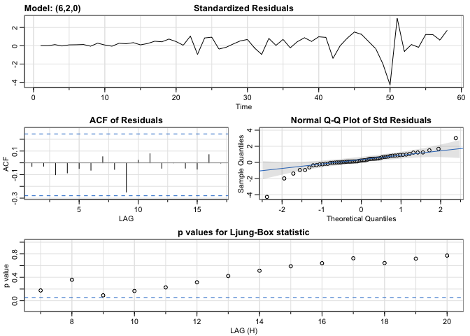

DATA 598: Assignment 1
================
Hriday Baghar
April 28, 2022

``` r
library(fpp3)
library(astsa)
library(knitr)
```

# Model the US GDP series found in the global_economy dataset in package fpp3. See textbook section 9.7 for an example of working with this dataset.

Loading the dataset and extracting the required series.

``` r
global_economy |>
  filter(Code == "USA") |>
  select(Country, Year, GDP) |>
  as_tsibble(index = Year) -> gdp.usa

kable(head(gdp.usa))
```

| Country       | Year |       GDP |
|:--------------|-----:|----------:|
| United States | 1960 | 5.433e+11 |
| United States | 1961 | 5.633e+11 |
| United States | 1962 | 6.051e+11 |
| United States | 1963 | 6.386e+11 |
| United States | 1964 | 6.858e+11 |
| United States | 1965 | 7.437e+11 |

## 1. Plot the series \[1 point\].

``` r
autoplot(gdp.usa, GDP)+
  ggtitle("Plot of US GDP Against Time")+
  labs(x = "Year")+
  scale_y_continuous(labels =  scales::dollar_format(suffix = " Trillion", scale = 1/1e12))
```

<!-- -->

## 2. Determine whether the series is stationary; if not, take appropriate action \[1 point\].

This series is clearly non-stationary, as can be seen with the rising
trend. We confirm this using a KPSS test:

``` r
gdp.usa |>
  features(GDP, unitroot_kpss)
```

    ## # A tibble: 1 × 3
    ##   Country       kpss_stat kpss_pvalue
    ##   <fct>             <dbl>       <dbl>
    ## 1 United States      1.49        0.01

Since the p-value is \< 0.05, we reject the null hypothesis that the
data is stationary.

We need to make this data stationary. We do this by applying a
difference operation. Let us use the `unitroot_ndiffs()` function to
check how many difference operations are required.

``` r
gdp.usa |>
  features(GDP, unitroot_ndiffs)
```

    ## # A tibble: 1 × 2
    ##   Country       ndiffs
    ##   <fct>          <int>
    ## 1 United States      2

Two differences are required based on this function. Let us check what
happens with a first order difference operation:

``` r
gdp.usa  |>
  autoplot(difference(GDP)) +
  labs(title = "First order differenced series", x="Year")
```

    ## Warning: Removed 1 row(s) containing missing values (geom_path).

<!-- -->

``` r
gdp.usa |>
  features(difference(GDP), unitroot_kpss)
```

    ## # A tibble: 1 × 3
    ##   Country       kpss_stat kpss_pvalue
    ##   <fct>             <dbl>       <dbl>
    ## 1 United States      1.26        0.01

It is clear that a first order difference still has some trend is
non-stationary. The KPSS test supports this.

We take a second order difference and inspect it in a similar manner:

``` r
gdp.usa  |>
  autoplot(difference(GDP, differences = 2)) +
  labs(title = "Second order differenced series", x="Year")
```

    ## Warning: Removed 2 row(s) containing missing values (geom_path).

<!-- -->

``` r
gdp.usa |>
  features(difference(GDP, differences = 2), unitroot_kpss)
```

    ## # A tibble: 1 × 3
    ##   Country       kpss_stat kpss_pvalue
    ##   <fct>             <dbl>       <dbl>
    ## 1 United States    0.0346         0.1

Both the plot and the KPSS test support that the series is now
stationary.

## 3. Include appropriate ACF and PACF plots and interpret them \[1 point\].

``` r
gdp.usa |>
  mutate(diff.2 = difference(GDP, differences = 2)) |>
  gg_tsdisplay(diff.2, plot_type = "partial")
```

    ## Warning: Removed 2 row(s) containing missing values (geom_path).

    ## Warning: Removed 2 rows containing missing values (geom_point).

<!-- -->

From the ACF and PACF plots we observe:

1.  ACF exhibits sinusoidal-like behavior with a significant spike at
    lag 7
2.  PACF has has a significant spike at lag 6 and none beyond that

Since the decay is sinusoidal in ACF and PACF has a spike at lag 6, an
AR6 model looks like a good candidate for this series. We might explore
an MA7 model to but we do not see a sinusoidal or exponential decay in
the PACF, which is why AR6 seems to be a better choice.

## 4. Use sarima() to fit at least one model for the series \[1 point\].

``` r
sarima(gdp.usa$GDP, p=6,d=2,q=0)
```

    ## initial  value 25.951065 
    ## iter   2 value 25.874895
    ## iter   3 value 25.808612
    ## iter   4 value 25.789582
    ## iter   5 value 25.788963
    ## iter   6 value 25.788961
    ## iter   7 value 25.788960
    ## iter   7 value 25.788960
    ## iter   7 value 25.788960
    ## final  value 25.788960 
    ## converged
    ## initial  value 25.744868 
    ## iter   2 value 25.744601
    ## iter   3 value 25.744369
    ## iter   4 value 25.744024
    ## iter   5 value 25.744018
    ## iter   6 value 25.744017
    ## iter   6 value 25.744017
    ## iter   6 value 25.744017
    ## final  value 25.744017 
    ## converged

<!-- -->

    ## $fit
    ## 
    ## Call:
    ## arima(x = xdata, order = c(p, d, q), seasonal = list(order = c(P, D, Q), period = S), 
    ##     include.mean = !no.constant, transform.pars = trans, fixed = fixed, optim.control = list(trace = trc, 
    ##         REPORT = 1, reltol = tol))
    ## 
    ## Coefficients:
    ##           ar1      ar2      ar3      ar4      ar5      ar6
    ##       -0.4218  -0.4334  -0.4539  -0.3279  -0.3445  -0.2715
    ## s.e.   0.1305   0.1316   0.1372   0.1351   0.1283   0.1270
    ## 
    ## sigma^2 estimated as 2.249e+22:  log likelihood = -1521.13,  aic = 3056.25
    ## 
    ## $degrees_of_freedom
    ## [1] 50
    ## 
    ## $ttable
    ##     Estimate     SE t.value p.value
    ## ar1  -0.4218 0.1305 -3.2323  0.0022
    ## ar2  -0.4334 0.1316 -3.2932  0.0018
    ## ar3  -0.4539 0.1372 -3.3078  0.0017
    ## ar4  -0.3279 0.1351 -2.4276  0.0188
    ## ar5  -0.3445 0.1283 -2.6853  0.0098
    ## ar6  -0.2715 0.1270 -2.1377  0.0375
    ## 
    ## $AIC
    ## [1] 54.57591
    ## 
    ## $AICc
    ## [1] 54.60652
    ## 
    ## $BIC
    ## [1] 54.82908

## 5. Comment on the residual plots from sarima() \[1 point\].

From the `sarima()` plots, we can conclude that the residuals are white
noise because:

-   The ACF spikes are all non-significant
-   The residuals have constant variance, although the end of the
    residual plot appears to have some departure from 0
-   P-values from the Ljung-Box plot are all above the significance
    level, although lag 9 and 10 are somewhat close
