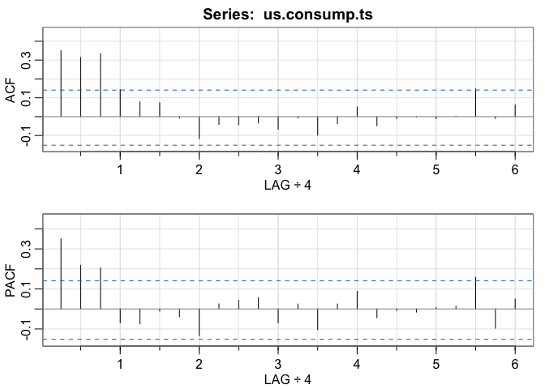

Week 3 Lab: Part 1
================

``` r
library(astsa)
library(forecast)
library(tseries)
```

## Read uschange.csv

``` r
us.consump <- read.csv("uschange.csv")
us.consump.ts <- ts(us.consump$Consumption, frequency = 4, start = c(1970,1))
plot(us.consump.ts)
```

<!-- -->

## Checking the stationarity assumption

``` r
kpss.test(us.consump.ts)
```

    ## Warning in kpss.test(us.consump.ts): p-value greater than printed p-value

    ## 
    ##  KPSS Test for Level Stationarity
    ## 
    ## data:  us.consump.ts
    ## KPSS Level = 0.28481, Truncation lag parameter = 4, p-value = 0.1

Fail to reject H0 - Series is stationary

The series is a day over day percentage change - which means it is
already differenced

## Plotting the ACF and PACF

``` r
acf2(us.consump.ts)
```

<!-- -->

    ##      [,1] [,2] [,3]  [,4]  [,5]  [,6]  [,7]  [,8]  [,9] [,10] [,11] [,12] [,13]
    ## ACF  0.35 0.31 0.33  0.14  0.08  0.07 -0.01 -0.12 -0.04 -0.04 -0.03 -0.07 -0.01
    ## PACF 0.35 0.22 0.21 -0.07 -0.07 -0.01 -0.04 -0.13  0.02  0.04  0.06 -0.07  0.02
    ##      [,14] [,15] [,16] [,17] [,18] [,19] [,20] [,21] [,22] [,23] [,24]
    ## ACF   -0.1 -0.04  0.05 -0.05 -0.01  0.00 -0.01  0.00  0.15 -0.01  0.06
    ## PACF  -0.1  0.02  0.09 -0.04 -0.01 -0.02  0.01  0.01  0.16 -0.10  0.05

Graph shows LAG÷4 because we read the data with freq = 4.  
That means 1 on the x-axis is 1 year or 4 quarters

## Use the ACF and PACF plots to identify what kind of series does this follow?

Remember:

> Characteristics of AR processes:
>
> -   ACF decays exponentially or is sinusoidal (like a sine wave)
> -   There is a significant spike at lag q in PACF, but none beyond q
>
> Characteristics of MA processes:
>
> -   PACF decays exponentially or is sinusoidal
> -   There is a significant spike at lag q in ACF, but none beyond q

Based on this we guess MA 3

## Building an MA3 model

``` r
cons.ts.ma3 <- sarima(us.consump.ts, p = 0, d = 0, q =3)
```

    ## initial  value -0.425269 
    ## iter   2 value -0.521111
    ## iter   3 value -0.528282
    ## iter   4 value -0.529865
    ## iter   5 value -0.529973
    ## iter   6 value -0.529974
    ## iter   7 value -0.529974
    ## iter   7 value -0.529974
    ## iter   7 value -0.529974
    ## final  value -0.529974 
    ## converged
    ## initial  value -0.529203 
    ## iter   2 value -0.529209
    ## iter   3 value -0.529210
    ## iter   3 value -0.529210
    ## iter   3 value -0.529210
    ## final  value -0.529210 
    ## converged

<!-- -->

``` r
cons.ts.ma3
```

    ## $fit
    ## 
    ## Call:
    ## arima(x = xdata, order = c(p, d, q), seasonal = list(order = c(P, D, Q), period = S), 
    ##     xreg = xmean, include.mean = FALSE, transform.pars = trans, fixed = fixed, 
    ##     optim.control = list(trace = trc, REPORT = 1, reltol = tol))
    ## 
    ## Coefficients:
    ##          ma1     ma2     ma3   xmean
    ##       0.2403  0.2187  0.2665  0.7473
    ## s.e.  0.0717  0.0719  0.0635  0.0739
    ## 
    ## sigma^2 estimated as 0.3464:  log likelihood = -166.38,  aic = 342.76
    ## 
    ## $degrees_of_freedom
    ## [1] 183
    ## 
    ## $ttable
    ##       Estimate     SE t.value p.value
    ## ma1     0.2403 0.0717  3.3490  0.0010
    ## ma2     0.2187 0.0719  3.0400  0.0027
    ## ma3     0.2665 0.0635  4.1998  0.0000
    ## xmean   0.7473 0.0739 10.1084  0.0000
    ## 
    ## $AIC
    ## [1] 1.832932
    ## 
    ## $AICc
    ## [1] 1.834108
    ## 
    ## $BIC
    ## [1] 1.919326

## What do the plot results mean?

-   *Standardized residual plot:* Checking for constant variance
    assumption
-   *ACF of residuals:* We want the residuals to be non-significant and
    white noise. So if we find that the ACF of residuals has significant
    spikes, it means we have missed AR/MA terms
-   *QQ plot:* Checking the normality assumption - useful when we make
    forecasts because we assume normality
-   *Ljung-Box p-value plot:* Used to examine residuals from a time
    series model to test whether auto-correlations are significantly
    different from 0. Indication of white noise, we want to see all the
    p-values above the blue line

## What do the console results mean?

-   *ttable:* Coefficient estimates along with hypothesis tests and
    p-value (interpreted just like in regression models)
-   *AIC:* Akaike’s Information Criterion. A model fit parameter that
    helps compare fit of different subsets of models. Lesser is better.
-   *AICc:* Akaike’s Information Criterion corrected. Adds extra penalty
    for more parameters. Used more commonly in time series models than
    AIC.
-   *BIC:* Closely related to BIC but does not penalize for more
    parameters
-   *sigma^2:* Variance of the residual

## Let’s try an AR3 model - Instructor’s recommendation

``` r
cons.ts.ar3 <- sarima(us.consump.ts, p = 3, d = 0, q = 0)
```

    ## initial  value -0.417908 
    ## iter   2 value -0.475509
    ## iter   3 value -0.529162
    ## iter   4 value -0.529471
    ## iter   5 value -0.529476
    ## iter   6 value -0.529476
    ## iter   7 value -0.529477
    ## iter   8 value -0.529477
    ## iter   9 value -0.529477
    ## iter  10 value -0.529477
    ## iter  10 value -0.529477
    ## final  value -0.529477 
    ## converged
    ## initial  value -0.535659 
    ## iter   2 value -0.535670
    ## iter   3 value -0.535674
    ## iter   4 value -0.535676
    ## iter   5 value -0.535676
    ## iter   6 value -0.535677
    ## iter   7 value -0.535677
    ## iter   8 value -0.535677
    ## iter   8 value -0.535677
    ## iter   8 value -0.535677
    ## final  value -0.535677 
    ## converged

<!-- -->

``` r
cons.ts.ar3
```

    ## $fit
    ## 
    ## Call:
    ## arima(x = xdata, order = c(p, d, q), seasonal = list(order = c(P, D, Q), period = S), 
    ##     xreg = xmean, include.mean = FALSE, transform.pars = trans, fixed = fixed, 
    ##     optim.control = list(trace = trc, REPORT = 1, reltol = tol))
    ## 
    ## Coefficients:
    ##          ar1     ar2     ar3   xmean
    ##       0.2274  0.1604  0.2027  0.7449
    ## s.e.  0.0713  0.0723  0.0712  0.1029
    ## 
    ## sigma^2 estimated as 0.3419:  log likelihood = -165.17,  aic = 340.34
    ## 
    ## $degrees_of_freedom
    ## [1] 183
    ## 
    ## $ttable
    ##       Estimate     SE t.value p.value
    ## ar1     0.2274 0.0713  3.1914  0.0017
    ## ar2     0.1604 0.0723  2.2202  0.0276
    ## ar3     0.2027 0.0712  2.8487  0.0049
    ## xmean   0.7449 0.1029  7.2395  0.0000
    ## 
    ## $AIC
    ## [1] 1.819999
    ## 
    ## $AICc
    ## [1] 1.821174
    ## 
    ## $BIC
    ## [1] 1.906392

We see that the AR3 model is a slightly better fit.

## Trying an MA4 model

We saw a spike at lag 4 of the ACF that was very close to the
significance level so we can check if an MA4 model is suitable

``` r
cons.ts.ma4 <- sarima(us.consump.ts, p = 0, d = 0, q = 4)
```

    ## initial  value -0.425269 
    ## iter   2 value -0.520850
    ## iter   3 value -0.528811
    ## iter   4 value -0.531104
    ## iter   5 value -0.531511
    ## iter   6 value -0.531517
    ## iter   7 value -0.531518
    ## iter   8 value -0.531518
    ## iter   8 value -0.531518
    ## iter   8 value -0.531518
    ## final  value -0.531518 
    ## converged
    ## initial  value -0.530785 
    ## iter   2 value -0.530791
    ## iter   3 value -0.530793
    ## iter   4 value -0.530793
    ## iter   5 value -0.530793
    ## iter   5 value -0.530793
    ## iter   5 value -0.530793
    ## final  value -0.530793 
    ## converged

<!-- -->

``` r
cons.ts.ma4
```

    ## $fit
    ## 
    ## Call:
    ## arima(x = xdata, order = c(p, d, q), seasonal = list(order = c(P, D, Q), period = S), 
    ##     xreg = xmean, include.mean = FALSE, transform.pars = trans, fixed = fixed, 
    ##     optim.control = list(trace = trc, REPORT = 1, reltol = tol))
    ## 
    ## Coefficients:
    ##          ma1     ma2     ma3     ma4   xmean
    ##       0.2430  0.2128  0.2656  0.0657  0.7467
    ## s.e.  0.0734  0.0767  0.0630  0.0866  0.0764
    ## 
    ## sigma^2 estimated as 0.3454:  log likelihood = -166.08,  aic = 344.17
    ## 
    ## $degrees_of_freedom
    ## [1] 182
    ## 
    ## $ttable
    ##       Estimate     SE t.value p.value
    ## ma1     0.2430 0.0734  3.3105  0.0011
    ## ma2     0.2128 0.0767  2.7740  0.0061
    ## ma3     0.2656 0.0630  4.2154  0.0000
    ## ma4     0.0657 0.0866  0.7589  0.4489
    ## xmean   0.7467 0.0764  9.7718  0.0000
    ## 
    ## $AIC
    ## [1] 1.840462
    ## 
    ## $AICc
    ## [1] 1.842235
    ## 
    ## $BIC
    ## [1] 1.944134

We see that it is not a better fit, thereby proving our intuition was
right.

## Using auto.arima()

This is a function that was written by the authors of the book to
iterate through many iterations of ARIMA models and pick the best fit.

Algorithm:

-   Select number of differences using KPSS test
-   Select p (AR terms) and q (MA terms) by minimizing AICc
-   Use step-wise search to traverse model space

Although this tool is helpful, we should always inspect the results
because sometimes the model may add extra parameters for tiny
improvements.

``` r
auto.arima(us.consump.ts, seasonal = FALSE, trace = TRUE)
```

    ## 
    ##  Fitting models using approximations to speed things up...
    ## 
    ##  ARIMA(2,0,2)           with non-zero mean : 344.1017
    ##  ARIMA(0,0,0)           with non-zero mean : 375.6977
    ##  ARIMA(1,0,0)           with non-zero mean : 354.2954
    ##  ARIMA(0,0,1)           with non-zero mean : 360.4277
    ##  ARIMA(0,0,0)           with zero mean     : 529.7652
    ##  ARIMA(1,0,2)           with non-zero mean : 344.2643
    ##  ARIMA(2,0,1)           with non-zero mean : 346.4187
    ##  ARIMA(3,0,2)           with non-zero mean : 346.1652
    ##  ARIMA(2,0,3)           with non-zero mean : 344.7258
    ##  ARIMA(1,0,1)           with non-zero mean : 344.7111
    ##  ARIMA(1,0,3)           with non-zero mean : 342.6775
    ##  ARIMA(0,0,3)           with non-zero mean : 342.8043
    ##  ARIMA(1,0,4)           with non-zero mean : 344.691
    ##  ARIMA(0,0,2)           with non-zero mean : 356.9284
    ##  ARIMA(0,0,4)           with non-zero mean : 344.3619
    ##  ARIMA(2,0,4)           with non-zero mean : Inf
    ##  ARIMA(1,0,3)           with zero mean     : 358.3153
    ## 
    ##  Now re-fitting the best model(s) without approximations...
    ## 
    ##  ARIMA(1,0,3)           with non-zero mean : 342.0799
    ## 
    ##  Best model: ARIMA(1,0,3)           with non-zero mean

    ## Series: us.consump.ts 
    ## ARIMA(1,0,3) with non-zero mean 
    ## 
    ## Coefficients:
    ##          ar1      ma1     ma2     ma3    mean
    ##       0.5885  -0.3528  0.0846  0.1739  0.7454
    ## s.e.  0.1541   0.1658  0.0818  0.0843  0.0930
    ## 
    ## sigma^2 = 0.3499:  log likelihood = -164.81
    ## AIC=341.61   AICc=342.08   BIC=361

**Why are we seeing such large AICc values in auto.arima() compared to
sarima?**

A. Because sarima() scales the AICc by series length

Let us re-run auto.arima using stepwise = FALSE. This allows us to
iterate over more model options.

``` r
auto.arima(us.consump.ts, seasonal = FALSE, trace = TRUE, stepwise = FALSE)
```

    ## 
    ##  Fitting models using approximations to speed things up...
    ## 
    ##  ARIMA(0,0,0)           with zero mean     : 529.7652
    ##  ARIMA(0,0,0)           with non-zero mean : 375.6977
    ##  ARIMA(0,0,1)           with zero mean     : 459.7658
    ##  ARIMA(0,0,1)           with non-zero mean : 360.4277
    ##  ARIMA(0,0,2)           with zero mean     : 438.9277
    ##  ARIMA(0,0,2)           with non-zero mean : 356.9284
    ##  ARIMA(0,0,3)           with zero mean     : 402.6351
    ##  ARIMA(0,0,3)           with non-zero mean : 342.8043
    ##  ARIMA(0,0,4)           with zero mean     : 397.0379
    ##  ARIMA(0,0,4)           with non-zero mean : 344.3619
    ##  ARIMA(0,0,5)           with zero mean     : 390.6899
    ##  ARIMA(0,0,5)           with non-zero mean : 344.9052
    ##  ARIMA(1,0,0)           with zero mean     : 397.3279
    ##  ARIMA(1,0,0)           with non-zero mean : 354.2954
    ##  ARIMA(1,0,1)           with zero mean     : 355.0165
    ##  ARIMA(1,0,1)           with non-zero mean : 344.7111
    ##  ARIMA(1,0,2)           with zero mean     : 356.5962
    ##  ARIMA(1,0,2)           with non-zero mean : 344.2643
    ##  ARIMA(1,0,3)           with zero mean     : 358.3153
    ##  ARIMA(1,0,3)           with non-zero mean : 342.6775
    ##  ARIMA(1,0,4)           with zero mean     : Inf
    ##  ARIMA(1,0,4)           with non-zero mean : 344.691
    ##  ARIMA(2,0,0)           with zero mean     : 370.3182
    ##  ARIMA(2,0,0)           with non-zero mean : 348.0745
    ##  ARIMA(2,0,1)           with zero mean     : 357.8635
    ##  ARIMA(2,0,1)           with non-zero mean : 346.4187
    ##  ARIMA(2,0,2)           with zero mean     : 358.7792
    ##  ARIMA(2,0,2)           with non-zero mean : 344.1017
    ##  ARIMA(2,0,3)           with zero mean     : 359.0309
    ##  ARIMA(2,0,3)           with non-zero mean : 344.7258
    ##  ARIMA(3,0,0)           with zero mean     : 355.2131
    ##  ARIMA(3,0,0)           with non-zero mean : 342.9902
    ##  ARIMA(3,0,1)           with zero mean     : 357.3186
    ##  ARIMA(3,0,1)           with non-zero mean : 344.2385
    ##  ARIMA(3,0,2)           with zero mean     : 358.1068
    ##  ARIMA(3,0,2)           with non-zero mean : 346.1652
    ##  ARIMA(4,0,0)           with zero mean     : 356.2861
    ##  ARIMA(4,0,0)           with non-zero mean : 342.3964
    ##  ARIMA(4,0,1)           with zero mean     : 355.341
    ##  ARIMA(4,0,1)           with non-zero mean : 342.132
    ##  ARIMA(5,0,0)           with zero mean     : 351.918
    ##  ARIMA(5,0,0)           with non-zero mean : 338.1819
    ## 
    ##  Now re-fitting the best model(s) without approximations...
    ## 
    ## 
    ## 
    ## 
    ##  Best model: ARIMA(5,0,0)           with non-zero mean

    ## Series: us.consump.ts 
    ## ARIMA(5,0,0) with non-zero mean 
    ## 
    ## Coefficients:
    ##          ar1     ar2     ar3      ar4      ar5    mean
    ##       0.2361  0.1883  0.2308  -0.0482  -0.0750  0.7462
    ## s.e.  0.0726  0.0747  0.0737   0.0754   0.0739  0.0901
    ## 
    ## sigma^2 = 0.3496:  log likelihood = -164.22
    ## AIC=342.43   AICc=343.06   BIC=365.05
