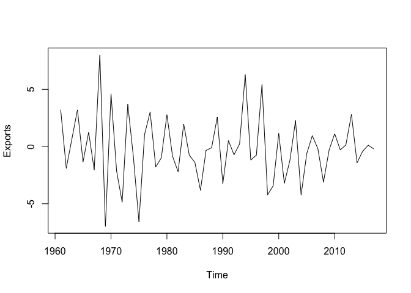
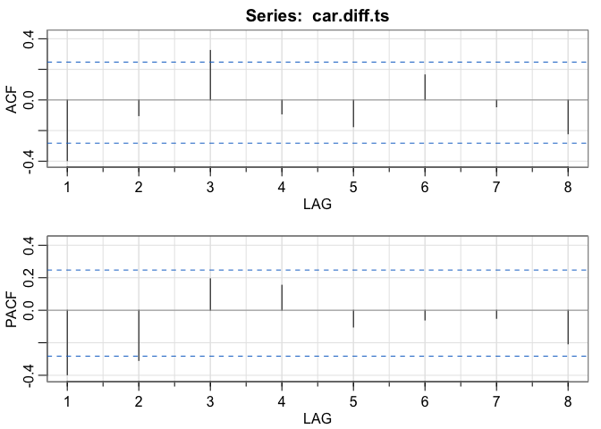
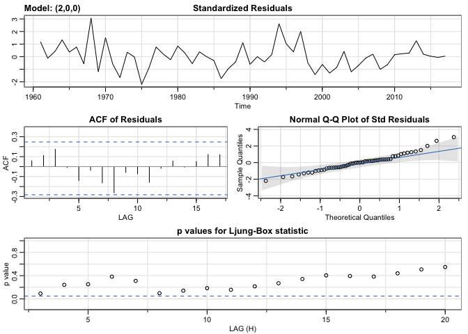
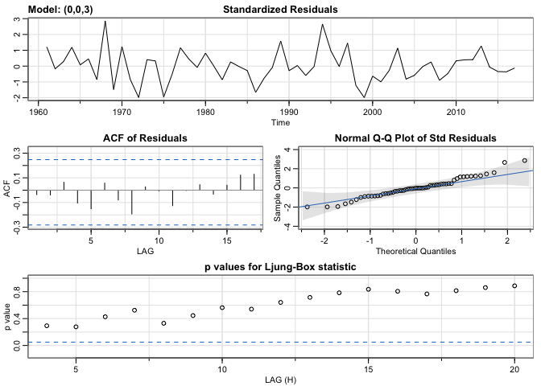

Week 3 Lab: Part 2
================

``` r
library(tseries)
library(astsa)
library(forecast)
```

# Read CAR Exports data

``` r
car.df <- read.csv("CAR_exports.csv")
head(car.df)
```

    ##    Exports
    ## 1 23.27272
    ## 2 26.49007
    ## 3 24.59017
    ## 4 25.23659
    ## 5 28.44827
    ## 6 27.10027

``` r
str(car.df)
```

    ## 'data.frame':    58 obs. of  1 variable:
    ##  $ Exports: num  23.3 26.5 24.6 25.2 28.4 ...

Converting to time series object:

``` r
car.ts <- ts(car.df, frequency = 1, start = c(1960))
plot(car.ts)
```

<!-- -->

# Check for stationarity:

Above plot shows that the series is non-stationary, due to the downward
trend. Let’s do an extra test to make sure

``` r
kpss.test(car.ts)
```

    ## Warning in kpss.test(car.ts): p-value smaller than printed p-value

    ## 
    ##  KPSS Test for Level Stationarity
    ## 
    ## data:  car.ts
    ## KPSS Level = 1.2824, Truncation lag parameter = 3, p-value = 0.01

We see that the series is non-stationary based on p-value.

# Differencing

``` r
car.diff.ts <- diff(car.ts, lag = 1)
plot(car.diff.ts)
```

<!-- -->

Let’s check for stationarity:

``` r
kpss.test(car.diff.ts)
```

    ## Warning in kpss.test(car.diff.ts): p-value greater than printed p-value

    ## 
    ##  KPSS Test for Level Stationarity
    ## 
    ## data:  car.diff.ts
    ## KPSS Level = 0.092232, Truncation lag parameter = 3, p-value = 0.1

Series is stationary!

# Modeling series

``` r
acf2(car.diff.ts)
```

<!-- -->

    ##      [,1]  [,2] [,3]  [,4]  [,5]  [,6]  [,7]  [,8]
    ## ACF  -0.4 -0.10 0.32 -0.09 -0.17  0.16 -0.04 -0.22
    ## PACF -0.4 -0.31 0.19  0.15 -0.10 -0.06 -0.05 -0.21

We consider the following models:

-   AR2: We see 2 significant spikes in the PACF
-   MA3: We see significant spikes in ACF at lag 1 and 3. Even though
    2nd spike is not significant, we should check it out

## AR2 model

``` r
sarima(car.diff.ts, p=2,d=0,q=0)
```

    ## initial  value 1.064229 
    ## iter   2 value 0.951368
    ## iter   3 value 0.935509
    ## iter   4 value 0.932371
    ## iter   5 value 0.929084
    ## iter   6 value 0.927239
    ## iter   7 value 0.927238
    ## iter   8 value 0.927238
    ## iter   8 value 0.927238
    ## final  value 0.927238 
    ## converged
    ## initial  value 0.925441 
    ## iter   2 value 0.925409
    ## iter   3 value 0.925393
    ## iter   4 value 0.925391
    ## iter   5 value 0.925391
    ## iter   5 value 0.925391
    ## iter   5 value 0.925391
    ## final  value 0.925391 
    ## converged

<!-- -->

    ## $fit
    ## 
    ## Call:
    ## arima(x = xdata, order = c(p, d, q), seasonal = list(order = c(P, D, Q), period = S), 
    ##     xreg = xmean, include.mean = FALSE, transform.pars = trans, fixed = fixed, 
    ##     optim.control = list(trace = trc, REPORT = 1, reltol = tol))
    ## 
    ## Coefficients:
    ##           ar1      ar2    xmean
    ##       -0.5230  -0.3065  -0.2120
    ## s.e.   0.1262   0.1248   0.1841
    ## 
    ## sigma^2 estimated as 6.323:  log likelihood = -133.63,  aic = 275.25
    ## 
    ## $degrees_of_freedom
    ## [1] 54
    ## 
    ## $ttable
    ##       Estimate     SE t.value p.value
    ## ar1    -0.5230 0.1262 -4.1460  0.0001
    ## ar2    -0.3065 0.1248 -2.4563  0.0173
    ## xmean  -0.2120 0.1841 -1.1514  0.2546
    ## 
    ## $AIC
    ## [1] 4.829009
    ## 
    ## $AICc
    ## [1] 4.836953
    ## 
    ## $BIC
    ## [1] 4.972381

Observations:

-   ACF looks good - no significant spikes
-   Ljung-box looks OK - some values are close to the line

## MA3 model

``` r
sarima(car.diff.ts, p=0,d=0,q=3)
```

    ## initial  value 1.061848 
    ## iter   2 value 0.925456
    ## iter   3 value 0.912523
    ## iter   4 value 0.910179
    ## iter   5 value 0.909894
    ## iter   6 value 0.909889
    ## iter   7 value 0.909843
    ## iter   8 value 0.909841
    ## iter   9 value 0.909841
    ## iter   9 value 0.909841
    ## iter   9 value 0.909841
    ## final  value 0.909841 
    ## converged
    ## initial  value 0.912718 
    ## iter   2 value 0.912652
    ## iter   3 value 0.912622
    ## iter   4 value 0.912620
    ## iter   5 value 0.912612
    ## iter   6 value 0.912612
    ## iter   7 value 0.912612
    ## iter   7 value 0.912612
    ## iter   7 value 0.912612
    ## final  value 0.912612 
    ## converged

<!-- -->

    ## $fit
    ## 
    ## Call:
    ## arima(x = xdata, order = c(p, d, q), seasonal = list(order = c(P, D, Q), period = S), 
    ##     xreg = xmean, include.mean = FALSE, transform.pars = trans, fixed = fixed, 
    ##     optim.control = list(trace = trc, REPORT = 1, reltol = tol))
    ## 
    ## Coefficients:
    ##           ma1     ma2     ma3    xmean
    ##       -0.4537  0.0922  0.2677  -0.1999
    ## s.e.   0.1319  0.1532  0.1354   0.2946
    ## 
    ## sigma^2 estimated as 6.147:  log likelihood = -132.9,  aic = 275.8
    ## 
    ## $degrees_of_freedom
    ## [1] 53
    ## 
    ## $ttable
    ##       Estimate     SE t.value p.value
    ## ma1    -0.4537 0.1319 -3.4387  0.0011
    ## ma2     0.0922 0.1532  0.6018  0.5499
    ## ma3     0.2677 0.1354  1.9762  0.0533
    ## xmean  -0.1999 0.2946 -0.6787  0.5003
    ## 
    ## $AIC
    ## [1] 4.838539
    ## 
    ## $AICc
    ## [1] 4.852034
    ## 
    ## $BIC
    ## [1] 5.017754

Residuals looks much better than AR2
