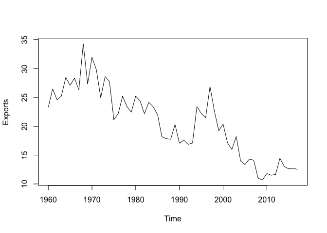

Week 3 Lab: Part 2
================

``` r
library(tseries)
library(astsa)
library(forecast)
```

``` r
car.df <- read.csv("CAR_exports.csv")
head(car.df)
```

    ##    Exports
    ## 1 23.27272
    ## 2 26.49007
    ## 3 24.59017
    ## 4 25.23659
    ## 5 28.44827
    ## 6 27.10027

``` r
str(car.df)
```

    ## 'data.frame':    58 obs. of  1 variable:
    ##  $ Exports: num  23.3 26.5 24.6 25.2 28.4 ...

Converting to time series object:

``` r
# Implement in tidyverse
car.ts <- ts(car.df, frequency = 1, start = c(1960))
plot(car.ts)
```

<!-- --> Check
for stationarity:

Above plot shows that the series is non-stationary, due to the downward
trend. Let’s do an extra test to make sure

``` r
kpss.test(car.ts)
```

    ## Warning in kpss.test(car.ts): p-value smaller than printed p-value

    ## 
    ##  KPSS Test for Level Stationarity
    ## 
    ## data:  car.ts
    ## KPSS Level = 1.2824, Truncation lag parameter = 3, p-value = 0.01

We see that the series is non-stationary based on p-value.
