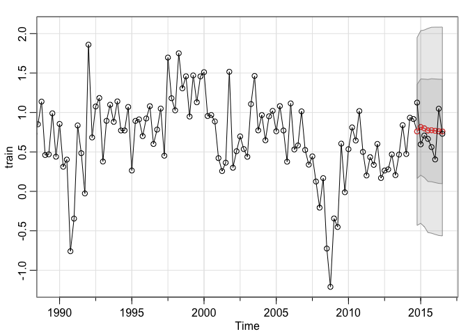
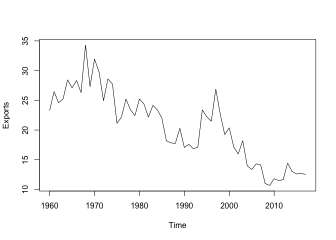
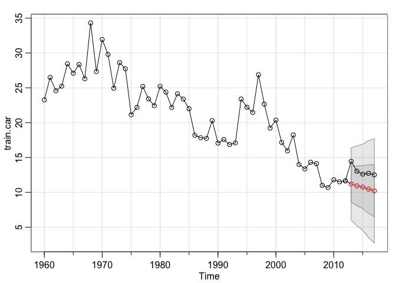

Week 4 Lab: Forecasting
================

``` r
library(astsa)
library(tseries)
library(forecast)
```

# US Exchange data

``` r
econ.df <-  read.csv("../Week 3/uschange.csv")
econ.ts <- ts(data = econ.df$Consumption, start = c(1970,1), frequency = 4)
```

## Splitting into train and test data

Set test test as last 2 years of data

``` r
train <- window(econ.ts, end = c(2014,3))
test <- window(econ.ts, start = c(2014,4))
```

## Forecast 1: Using AR3

``` r
econ.for.ar3 <- sarima.for(train, n.ahead = 8, p=3,d=0,q=0)
lines(test,type='o')
```

<!-- -->

### Checking predictions, standard error and accuracy metrics

``` r
econ.for.ar3$pred
```

    ##           Qtr1      Qtr2      Qtr3      Qtr4
    ## 2014                               0.7592713
    ## 2015 0.8151421 0.7992361 0.7721736 0.7749312
    ## 2016 0.7679696 0.7612651 0.7591895

``` r
econ.for.ar3$se
```

    ##           Qtr1      Qtr2      Qtr3      Qtr4
    ## 2014                               0.5951798
    ## 2015 0.6104689 0.6233521 0.6468253 0.6527054
    ## 2016 0.6568219 0.6601469 0.6616638

``` r
accuracy(econ.for.ar3$pred, test)
```

    ##                   ME      RMSE      MAE       MPE     MAPE       ACF1 Theil's U
    ## Test set -0.04635317 0.2403352 0.209479 -17.20294 32.17021 -0.2192948 0.6095889

## Forecast 2: MA3

``` r
econ.for.ma3 <- sarima.for(train, n.ahead = 8, p=0, d=0, q=3)
lines(test, type='o')
```

<!-- -->

### Checking predictions, standard error and accuracy metrics

``` r
econ.for.ma3$pred
```

    ##           Qtr1      Qtr2      Qtr3      Qtr4
    ## 2014                               0.7684959
    ## 2015 0.8294796 0.7762064 0.7482994 0.7482994
    ## 2016 0.7482994 0.7482994 0.7482994

``` r
econ.for.ma3$se
```

    ##           Qtr1      Qtr2      Qtr3      Qtr4
    ## 2014                               0.5992754
    ## 2015 0.6167509 0.6303375 0.6505349 0.6505349
    ## 2016 0.6505349 0.6505349 0.6505349

``` r
accuracy(econ.for.ma3$pred, test)
```

    ##                  ME      RMSE       MAE       MPE     MAPE       ACF1 Theil's U
    ## Test set -0.0346657 0.2335069 0.1987268 -15.20915 30.28087 -0.2649462  0.599451

# CAR Exports Data

``` r
car.df <- read.csv("../Week 3/CAR_exports.csv")
head(car.df)
```

    ##    Exports
    ## 1 23.27272
    ## 2 26.49007
    ## 3 24.59017
    ## 4 25.23659
    ## 5 28.44827
    ## 6 27.10027

``` r
str(car.df)
```

    ## 'data.frame':    58 obs. of  1 variable:
    ##  $ Exports: num  23.3 26.5 24.6 25.2 28.4 ...

Converting to time series object:

``` r
car.ts <- ts(car.df, frequency = 1, start = c(1960))
plot(car.ts)
```

<!-- -->

## Split into train and test set

``` r
train.car <- window(car.ts, end = 2012)
test.car <- window(car.ts, start= 2012)
```

## Forecast: AR2

``` r
car.for <- sarima.for(train.car, n.ahead = 5, p=2, d=1, q=0)
lines(test.car, type='o')
```

<!-- -->

### Checking predictions, standard error and accuracy metrics

``` r
car.for$pred
```

    ## Time Series:
    ## Start = 2013 
    ## End = 2017 
    ## Frequency = 1 
    ## [1] 11.20501 10.93529 10.75241 10.46941 10.21258

``` r
car.for$se
```

    ## Time Series:
    ## Start = 2013 
    ## End = 2017 
    ## Frequency = 1 
    ## [1] 2.593501 2.865439 3.085183 3.479775 3.745508

``` r
accuracy(car.for$pred, test.car)
```

    ##                ME     RMSE      MAE      MPE     MAPE        ACF1 Theil's U
    ## Test set 2.353187 2.400288 2.353187 17.89092 17.89092 -0.04699433  3.099274
