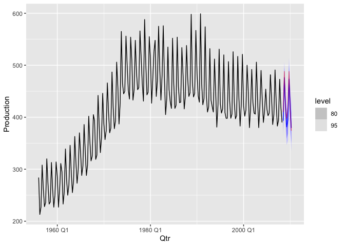

R Notebook
================

``` r
library(fpp3)
```

## Read ausbeer.csv and display it

``` r
ausbeer.ts <- read.csv("ausbeer.csv") |>
  mutate(Qtr = yearquarter(Time)) |>
  select(Qtr, Production, -Time) |>
  as_tsibble(index = Qtr)

ausbeer.ts |>
  autoplot(Production)
```

<!-- -->

## Checking for stationarity

Taking seasonal difference:

``` r
ausbeer.ts |>
  mutate(seas.diff = difference(Production, lag=4)) -> ausbeer.ts
  
ausbeer.ts |>
  autoplot(seas.diff)
```

    ## Warning: Removed 4 row(s) containing missing values (geom_path).

<!-- -->

``` r
ausbeer.ts |>
  features(seas.diff, unitroot_kpss)
```

    ## # A tibble: 1 × 2
    ##   kpss_stat kpss_pvalue
    ##       <dbl>       <dbl>
    ## 1      1.21        0.01

We reject the null hypothesis, this series is not stationary.

Applying a non-seasonal difference on the seasonally differenced series:

``` r
ausbeer.ts |>
  mutate(s.ns.diff = difference(seas.diff, lag=1)) -> ausbeer.ts

ausbeer.ts |>
  autoplot(s.ns.diff)
```

    ## Warning: Removed 5 row(s) containing missing values (geom_path).

<!-- -->

``` r
ausbeer.ts |>
  features(s.ns.diff, unitroot_kpss)
```

    ## # A tibble: 1 × 2
    ##   kpss_stat kpss_pvalue
    ##       <dbl>       <dbl>
    ## 1    0.0399         0.1

This data is now stationary.

## Analyze ACF and PACF

``` r
ausbeer.ts |>
  gg_tsdisplay(s.ns.diff, plot_type = "partial")
```

    ## Warning: Removed 5 row(s) containing missing values (geom_path).

    ## Warning: Removed 5 rows containing missing values (geom_point).

<!-- --> ACF:

-   We see significant spikes at lag 1, 3 and 4
-   Spike at lag 1 is likely indicative of non-seasonal MA
-   Spike at lag 4 is likely indicative of seasonal MA
-   We see spikes at lag 3 and 5 but they can be due to the
    autocorrelation at lag 1 and 4

PACF:

-   We see significant spikes at lags 1 and 2 likely indicating
    non-seasonal AR2

Pro tip: Check for spikes within the first seasonal range to develop
model intuition

## Model series

Splitting into train and test set

``` r
train <- ausbeer.ts |> filter(Qtr < yearquarter("2008 Q3"))
test <- ausbeer.ts |> filter(Qtr >= yearquarter("2008 Q3"))
```

We model the series based on the ACF and PACF.

The model we choose will be (2,1,1)(0,1,1)4 because:

-   Seasonal spike at lag 4
-   Non-seasonal MA term at lag 1, non-seasonal AR terms at lag 1,2
-   1 seasonal and 1 non-seasonal difference

``` r
fit <- train |> model(arima211011 = ARIMA(Production ~ pdq(2,1,1) + PDQ(0,1,1)))

fit |> gg_tsresiduals()
```

<!-- --> -
Residuals appear to be white noise for the most part.

``` r
glance(fit)
```

    ## # A tibble: 1 × 8
    ##   .model      sigma2 log_lik   AIC  AICc   BIC ar_roots  ma_roots 
    ##   <chr>        <dbl>   <dbl> <dbl> <dbl> <dbl> <list>    <list>   
    ## 1 arima211011   244.   -854. 1718. 1719. 1735. <cpl [2]> <cpl [5]>

``` r
report(fit)
```

    ## Series: Production 
    ## Model: ARIMA(2,1,1)(0,1,1)[4] 
    ## 
    ## Coefficients:
    ##           ar1      ar2      ma1     sma1
    ##       -0.5613  -0.2150  -0.4075  -0.7034
    ## s.e.   0.1296   0.1056   0.1226   0.0526
    ## 
    ## sigma^2 estimated as 243.8:  log likelihood=-854.16
    ## AIC=1718.32   AICc=1718.62   BIC=1734.93

# Forecasting

``` r
train |>
  model(arima211011 = ARIMA(Production ~ pdq(2,1,1) + PDQ(0,1,1))) |>
  forecast(h=8) |>
  autoplot(train)+
  geom_line(data = test, aes(x=Qtr, y=Production), color = "red", alpha=0.5)
```

<!-- -->
